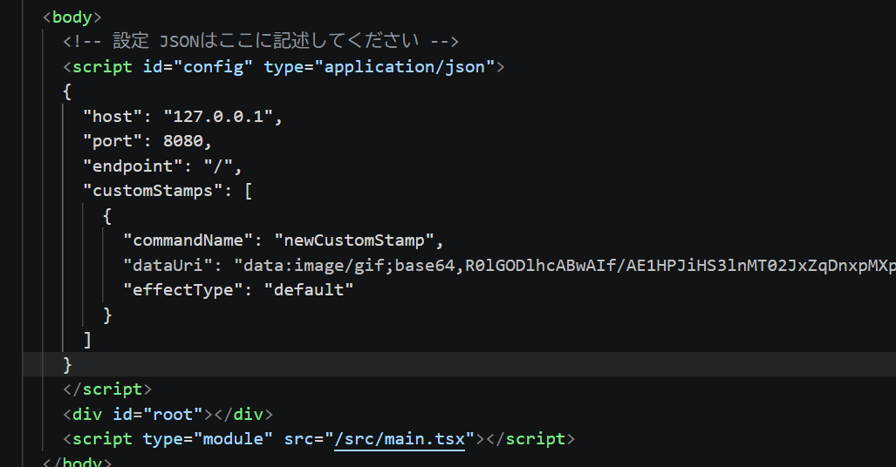

# twitch-text-flow-overlay

Streamer.botを利用したオーバーレイです。
基本的な機能はチャットで書かれたコメントがが右から左へ流れます。(ただしエモートいくつかには対応できていません。)

## 設定方法

- OBSの設定
  - ブラウザソースにtwitch-text-flow-overlay.htmlを追加してください。
  - ツール > WebSocketサーバー > \[WebSocketサーバーの設定を有効にする\]にチェックを入れ、「認証を有効にする」にもチェックを入れます。
    
- Streamer.bot側の設定
  - Twitchアカウントを連携してください。(結構な権限を付与するため、ここで同意できない場合はStreamer.botやこのオーバーレイをしないでください。)
  - Streamer.botとOBSを連携する設定を行います。
    - Stream App > OBS Studioをクリックします
    - Nameに任意の名前を入力します。
    - Passwordを入力します。これはOBSのサーバーパスワードの部分です。OBSの接続情報を表示するボタンを押すことで確認することができます。
    - 「Auto connect on Startup」と「Reconnect on disconnect」にチェックを入れます。
    - 「OK」で適用します。
    - ※OBSのバージョンを固定していて最新ではない場合、Versionドロップダウンリストを変更するといいかもしれません。
      

  - Streamer.botとtwitch-text-flow-overlayを連携
    - Servers/ClientsタブのWebSocket Serverのタブに移動してください。
      - Auto Startを\[On\]にしてください。
      - Server StatusでステータスがRunnningになっているか確認してください。なっていない場合はStart Serverを押して開始してください。Auto StartがOnの場合は次回起動時からここが自動でRunningになっているはずです。
    - ※AddressやPort、Endpointを変更している方はtwitch-text-flow-overlay.htmlに変更が必要です。(デフォルト値はhost = 127.0.0.1,port = 8080,endpoint = /)(Streamer.botのWebSocketのpasswordを設定した場合はこちらにも設定してください。passwordは最初は記述されていません。)
       - ※ password は秘密情報です。twitch-text-flow-overlay.html など配布・共有・公開され得るファイルに記述する場合は、リポジトリへコミットしないでください。また、第三者が閲覧できる場所には置かないでください。
    - twitch-text-flow-overlay.html
      

## リンク
- [Streamer.bot](https://streamer.bot/)

## 動作確認環境
  - Windows 11 Home (25H2)
  - OBS Studio 32.1.2(64 bit)
  - Streamer.bot(v1.0.4)

## コマンド一覧

基本的にはニコ動のコマンドに近しい動作です。

```
[コマンド] [コメント]
```
でその効果が得られます。


例えば
```
shita small これはコメントです。
```


- エフェクト

|コマンド|効果|
|---|---|
|kamifubuki|紙吹雪が30秒間降ります|
|maruta|丸太が10秒間降ります|
|snow|雪が30秒間降ります|
|sakura|桜が30秒間降ります|

- 文字サイズ

|コマンド|効果|
|---|---|
|small|小さいサイズのコメント|
|big|通常より大きいサイズのコメント|
|midium|通常サイズのコメント|

- 文字位置

|コマンド|効果|
|---|---|
|ue|画面上部に配置|
|shita|画面下部に配置|
|naka|画面中央に配置|
|migi|画面中央右に配置|
|migiue|画面右上に配置|
|migishita|画面右下に配置|
|hidari|画面中央左に配置|
|hidariue|画面左上に配置|
|hidarishita|画面左下に配置|

- 文字色

|コマンド|効果|
|---|---|
|white|#ffffff|
|red|#ff0000|
|pink|#ff8080|
|orange|#ff0000|
|yellow|#ffff00|
|green|#00ff00|
|cyan|#00ffff|
|blue|#0000ff|
|purple|#c000ff|
|black|#000000|
|white2 or niconicowhite|#cccc99|
|red2 or truered|#cc00ff|
|pink2|#ff33cc|
|orange2 or passionorange|#ff6600|
|yellow2 or madyellow|#999900|
|green2 or elementalgreen|#00cc66|
|cyan2|#00cccc|
|blue2 or marineblue|#3399ff|
|purple2 or nobleviolet|#6633cc|
|black2|#666666|


## カスタムスタンプ(実験的)

- これは実験的な機能なので今後どうなるかわかりません。使う際は注意してください。この機能はなくなる可能性も変更される可能性もあります。

### 設定方法

- twitch-text-flow-overlay.htmlのconfig値のcustomStampsを修正してください。(※effectTypeについては現状defaultのみです)
- commandNameが既存のコマンドと被った場合は既存のコマンドが優先されます。
  

- カスタムスタンプのデータの形は以下の通りです。
``` json
{
  "commandName": "コマンド名",
  "dataUri": "画像のデータURI",
  "effectType": "default"
}
```

- 以下のように複数設定することができます。

``` json
"customStamps": [
  {
    "commandName": "コマンド名1",
    "dataUri": "画像のデータURI1",
    "effectType": "default"
  },
  {
    "commandName": "コマンド名2",
    "dataUri": "画像のデータURI2",
    "effectType": "default"
  }
]
```
